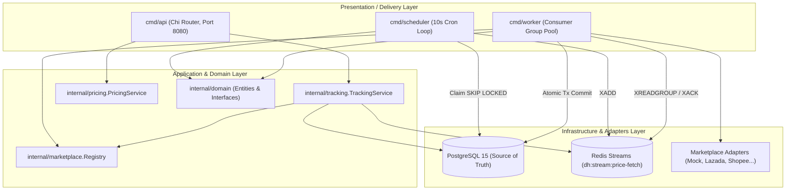

# Deal Hunter — Tổng Quan Kiến Trúc Hệ Thống

Tài liệu này mô tả kiến trúc tổng thể, mô hình phân tầng và các quyết định kỹ thuật của dự án **Deal Hunter**.

---

## 1. Phong Cách Kiến Trúc (Architectural Style)

Hệ thống được thiết kế theo mô hình **Modular Monolith (Multi-process Monolith)** kết hợp nguyên lý **Clean Architecture / Ports & Adapters (Hexagonal Architecture)**.

- **Đơn nhất về Codebase (Monolithic Codebase)**: Toàn bộ code nằm chung 1 Go module `github.com/tiendang/deal-hunter`, chia sẻ chung database PostgreSQL và hàng đợi Redis.
- **Tách biệt về Vận hành (Multi-process Runtime)**: Biên dịch thành 3 tiến trình Go độc lập (`cmd/api`, `cmd/scheduler`, `cmd/worker`) để đảm bảo khả năng co giãn (scaling) và cách ly tải.

---

## 2. Sơ Đồ Khối Hệ Thống



---

## 3. Cấu Trúc Phân Tầng Mã Nguồn (Source Tree)

```text
deal_hunter/
├── cmd/                      # Composition Root: Khởi tạo và ráp nối dependencies (Manual DI)
│   ├── api/main.go           # Khởi động REST API Server
│   ├── worker/main.go        # Khởi động Worker Pool cào giá
│   ├── scheduler/main.go     # Khởi động Scheduler quét định kỳ
│   └── migrate/main.go       # Công cụ chạy migration SQL
│
├── internal/                 # Mã nguồn đóng gói nghiệp vụ (Private to this module)
│   ├── domain/               # Core Entities (TrackedProduct, FetchJob) & Repository interfaces
│   ├── product/              # Sub-domain Product & ProductSource (Models, Repo PG)
│   ├── pricing/              # Sub-domain Pricing, Snapshot, Business Rule EffectivePrice()
│   ├── tracking/             # Service tiếp nhận URL và quản lý tracking
│   ├── jobs/                 # Worker pool logic, Scheduler logic, Job Repo PG
│   ├── marketplace/          # Port & Adapter sàn TMĐT (Registry, Mock, Lazada...)
│   ├── queue/                # Port & Adapter hàng đợi (Queue interface, Redis Stream)
│   └── http/                 # Delivery HTTP (Chi Router, Handlers, Middleware, CORS)
│
├── pkg/                      # Thư viện kỹ thuật dùng chung (Domain-agnostic)
│   ├── config/               # Load biến môi trường từ .env
│   ├── database/             # Quản lý connection pool PostgreSQL (pgxpool)
│   ├── metrics/              # Prometheus Metrics exporter
│   └── retry/                # Exponential backoff retry logic
│
├── migrations/               # Schema DDL versioned (Up / Down)
└── tests/                    # Integration tests (E2E flow, Idempotency replay)
```

---

## 4. Các Nguyên Tắc Thiết Kế Cốt Lõi

1. **Explicit Dependency Injection**: Không sử dụng biến toàn cục (`global state`). Tất cả database pools, redis clients và repositories đều được truyền qua constructor.
2. **Transaction Isolation**: Chuỗi thao tác ghi snapshot giá, cập nhật giá mới nhất và đánh dấu job thành công được bọc trong một `pgx.Tx` duy nhất.
3. **Idempotency**: Worker kiểm tra trạng thái job (`Status == Succeeded || Status == Dead`) trước khi xử lý, chống việc Redis replay message gây trùng lặp snapshot.
4. **Non-blocking Scheduler**: Sử dụng `FOR UPDATE SKIP LOCKED` kết hợp câu lệnh atomic update để nhiều scheduler replica có thể chạy song song mà không bao giờ bị conflict hoặc lock contention.
