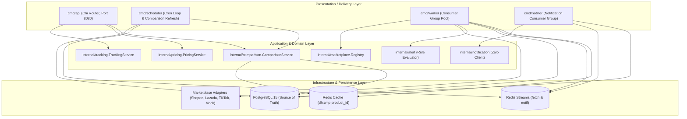

# Deal Hunter — Tong Quan Kien Truc He Thong

Tai lieu nay mo ta kien truc tong the, mo hinh phan tang va cac quyet dinh ky thuat cua du an **Deal Hunter** qua cac giai doan Phase 1, Phase 2 va Phase 3.

---

## 1. Phong Cach Kien Truc (Architectural Style)

He thong duoc thiet ke theo mo hinh **Modular Monolith (Multi-process Monolith)** ket hop nguyen ly **Clean Architecture / Ports & Adapters (Hexagonal Architecture)**.

- **Don nhat ve Codebase (Monolithic Codebase)**: Toan bo code nam chung 1 Go module `github.com/tiendang/deal-hunter`, chia se chung database PostgreSQL va hang doi / cache Redis.
- **Tach biet ve Van hanh (Multi-process Runtime)**: Bien dich thanh 4 tien trinh Go doc lap (`cmd/api`, `cmd/scheduler`, `cmd/worker`, `cmd/notifier`) de dam bao kha nang co gian (scaling) va cach ly tai.

---

## 2. So Do Khoi He Thong (System Architecture Diagram)



---

## 3. Cau Truc Phan Tang Ma Nguon (Source Tree)

```text
dealhunter/
├── cmd/                      # Composition Root: Khoi tao va rap noi dependencies (Manual DI)
│   ├── api/main.go           # Khoi dong REST API Server
│   ├── worker/main.go        # Khoi dong Worker Pool cao gia & danh gia canh bao
│   ├── scheduler/main.go     # Khoi dong Scheduler quet dinh ky va refresh so sanh
│   ├── notifier/main.go      # Khoi dong Notifier gui thong bao Zalo (Phase 2)
│   └── migrate/main.go       # Cong cu chay migration SQL
│
├── internal/                 # Ma nguon dong goi nghiep vu (Private to this module)
│   ├── domain/               # Core Entities (TrackedProduct, FetchJob) & Repository interfaces
│   ├── product/              # Sub-domain Product & ProductSource (Models, Repo PG)
│   ├── pricing/              # Sub-domain Pricing, Snapshot, Business Rule EffectivePrice()
│   ├── comparison/           # Sub-domain So sanh gia da nen tang & Best Deal (Phase 3)
│   ├── alert/                # Sub-domain Canh bao gia va danh gia luat (Phase 2)
│   ├── notification/         # Sub-domain Gui thong bao Zalo OA / ZNS (Phase 2)
│   ├── tracking/             # Service tiep nhan URL va quan ly tracking
│   ├── jobs/                 # Worker pool logic, Scheduler logic, Job Repo PG
│   ├── marketplace/          # Port & Adapter san TMDT (Registry, Shopee, Lazada, TikTok, Mock)
│   ├── queue/                # Port & Adapter hang doi (Queue interface, Redis Stream)
│   └── http/                 # Delivery HTTP (Chi Router, Handlers, Middleware, CORS)
│
├── pkg/                      # Thu vien ky thuat dung chung (Domain-agnostic)
│   ├── config/               # Load bien moi truong tu .env
│   ├── database/             # Quan ly connection pool PostgreSQL (pgxpool)
│   ├── metrics/              # Prometheus Metrics exporter
│   └── retry/                # Exponential backoff retry logic
│
├── migrations/               # Schema DDL versioned (000001, 000002, 000003)
└── tests/                    # Integration tests (E2E flow, Idempotency replay, Comparison full flow)
```

---

## 4. Cac Nguyen Tac Thiet Ke Cot Loi

1. **Explicit Dependency Injection**: Khong su dung bien toan cuc (`global state`). Tat ca database pools, redis clients va repositories deu duoc truyen qua constructor.
2. **Transaction Isolation**: Chuoi thao tac ghi snapshot gia, cap nhat gia moi nhat va danh dau job thanh cong duoc boc trong mot `pgx.Tx` duy nhat.
3. **Idempotency**: Worker kiem tra trang thai job (`Status == Succeeded || Status == Dead`) truoc khi xu ly, chong viec Redis replay message gay trung lap snapshot.
4. **Non-blocking Scheduler**: Su dung `FOR UPDATE SKIP LOCKED` ket hop cau lenh atomic update de nhieu scheduler replica co the chay song song ma khong bao gio bi conflict hoac lock contention.
5. **Multi-layer Comparison Caching (Phase 3)**:
   - Tang 1: Cache Redis toc do cao (`dh:cmp:{product_id}`, TTL 5 phut) phuc vu API `< 10ms`.
   - Tang 2: Bang materialized `comparison_snapshots` luu tru lich su ket qua so sanh trong PostgreSQL.
   - Cache Invalidation Pipeline: Worker tu dong xoa cache Redis ngay khi commit snapshot gia moi.
   - Periodic Refresh: Scheduler chay ticker 10 phut refresh cac nhom san pham da san.
6. **Multi-Marketplace Normalization & Canonical Product**:
   - Nguon hang duoc bieu dien boi `product_sources` gan voi san (`shopee`, `lazada`, `tiktok`).
   - Nhieu `product_sources` duoc gom chung vao mot thuc the logic `products` duy nhat.
   - Thuat toan `IdentifyBestDeal` chon nguon gia re nhat con hang dua tren `EffectivePrice` (gia niem yet + phi ship) va tinh toan so tien cung nhu ty le tiet kiem.
