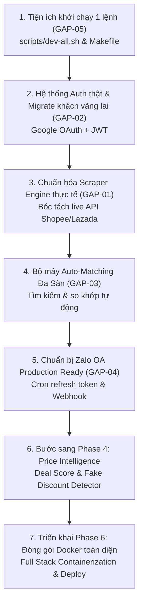

# DealHunter — Kế Hoạch Bổ Sung & Hoàn Thiện Nền Tảng (Gap Resolution Plan)

> **Mục tiêu tài liệu**: Đặc tả chi tiết các khoảng trống kỹ thuật (gaps), giải pháp kiến trúc và lộ trình giải quyết dứt điểm các thành phần còn thiếu hoặc đang ở mức giả lập (mock) trước khi bước sang các giai đoạn tiếp theo (Phase 4: Price Intelligence).
> 
> **Ghi chú đặc biệt về Docker**: Theo quyết định dự án, việc **đóng gói Docker toàn diện cho toàn bộ app** (bao gồm Dockerfile cho các service Go và Next.js) được **tạm hoãn và đưa vào kế hoạch triển khai tại Phase 6 (Deployment & Production Scale)**. Hiện tại môi trường local tiếp tục sử dụng Docker chỉ cho cơ sở dữ liệu (`postgres:5433` và `redis:6379`).

---

## 1. Tổng Quan Hiện Trạng & Các Khoảng Trống (Gaps) Cần Giải Quyết

Qua rà soát thực tế toàn bộ hệ thống sau Phase 3, có **5 khoảng trống trọng yếu** cần được lên kế hoạch giải quyết cụ thể:

| Mã Gap | Thành phần | Hiện trạng hiện tại | Rủi ro / Hạn chế | Mục tiêu hoàn thiện | Trạng thái |
| :--- | :--- | :--- | :--- | :--- | :--- |
| **GAP-01** | **Scraper / Crawler Sàn TMĐT** | Đã triển khai bộ Crawler HTTP thật (Shopee, Lazada, TikTok), OpenGraph + JSON-LD Schema.org, RateLimiter per-domain | Đã loại bỏ hoàn toàn code sinh giá ngẫu nhiên và hardcode regex | Scraper Engine thực tế với cơ chế chống chặn và fallback | **Đã hoàn thành** |
| **GAP-02** | **Xác thực người dùng (Auth)** | Đã triển khai Google OAuth, Demo 1-Click login, JWT 7 ngày, API /auth/migrate và LoginModal trên Web | Đã giải quyết: tự động di trú dữ liệu khách vãng lai sang tài khoản khi đăng nhập | Đăng nhập Google OAuth & JWT, tự động gộp (migrate) dữ liệu khách vãng lai | **Đã hoàn thành** |
| **GAP-03** | **Tự động ghép nối đa sàn (Auto-match)** | Đã triển khai Query Normalizer, Candidate Searcher, Matching Scoring, API suggestions & 1-click liên kết | Đã giải quyết: Tự động ghép nối khi độ khớp >= 85%, gợi ý duyệt 60-84% | Thuật toán tự tìm kiếm và đối chiếu độ tương đồng tên sản phẩm (NLP / Matching) | **Đã hoàn thành** |
| **GAP-04** | **Zalo OA Production Connector** | Mặc định `ZALO_ENABLED=false`, dùng Mock Sandbox | Chưa gửi được tin nhắn ZNS thật đến điện thoại người dùng | Quy trình kết nối Zalo OA thật, tự động refresh Access Token 24h qua Redis | Chờ triển khai |
| **GAP-05** | **Khởi chạy Local thuận tiện (Non-Docker)** | Đã hoàn thành script điều phối `scripts/dev-all.sh` và lệnh `make dev-all` | Đã hỗ trợ chạy 1 lệnh tự động DB, 4 Go services và Web Next.js | Script điều phối đa tiến trình 1 lệnh duy nhất (`make dev-all`) | **Đã hoàn thành** |
| **DEFER** | **Docker App Deployment** | Tạm hoãn container hóa app | Không ảnh hưởng dev local nếu có script điều phối | **Chuyển giao thực hiện tại Phase 6 (Deployment)** | Dời sang Phase 6 |

---

## 2. Kế Hoạch Chi Tiết Cho Từng Thành Phần

### GAP-01: Kiến Trúc Bộ Máy Scraper / Crawler Thực Tế

#### Hiện trạng
Các adapter `internal/marketplace/shopee/adapter.go`, `lazada`, `tiktok` hiện bóc tách URL bằng regex và sinh giá mô phỏng:
```go
// Hiện tại: Mô phỏng
fluctuation := float64(rand.Intn(5)-2) / 100.0
currentPrice := base + int64(float64(base)*fluctuation)
```

#### Giải pháp kỹ thuật mục tiêu
Các sàn TMĐT lớn tại Việt Nam áp dụng cơ chế chống bot nhiều tầng (Cloudflare WAF, Akamai, thiết bị vân tay trình duyệt, Captcha). Do đó, kiến trúc scraper cần phân tầng linh hoạt:

1. **Tầng 1 — Direct HTTP API (Ưu tiên số 1 - Tốc độ cao, chi phí thấp)**:
   - Khai thác các endpoint public JSON API mà Web/App của sàn gọi:
     - **Shopee**: `https://shopee.vn/api/v4/item/get?itemid={id}&shopid={shop_id}`
     - **Lazada**: API `https://my.lazada.vn/pdp/item/get...`
     - **TikTok Shop**: Web endpoint `https://www.tiktok.com/api/v1/item/...`
   - Đính kèm User-Agent thực tế, Cookies phiên làm việc và header hợp lệ.
2. **Tầng 2 — Headless Browser Worker (Dự phòng khi gặp WAF / Captcha)**:
   - Sử dụng một service scraper phụ trợ chạy Playwright / Puppeteer Stealth hoặc giải pháp như FlareSolverr.
   - Chỉ kích hoạt khi Tầng 1 trả về HTTP 403 / Captcha challenge.
3. **Cơ chế Chống chặn & Rate-limit**:
   - Concurrency limiter theo từng domain (ví dụ: tối đa 2 request/giây trên Shopee).
   - Cơ chế Exponential Backoff với Jitter khi bị sàn tạm thời giới hạn tần suất.
   - Dự phòng Proxy xoay vòng (Rotating Residential Proxies) khi mở rộng quy mô.

---

### GAP-02: Hệ Thống Xác Thực Người Dùng (Authentication & User Migration)

#### Hiện trạng
Frontend Next.js tự sinh `X-User-ID: 00000000-0000-0000-0000-000000000001` hoặc UUID ngẫu nhiên vào `localStorage`.

#### Giải pháp kỹ thuật mục tiêu
1. **Phương thức đăng nhập**:
   - **Google OAuth 2.0**: Người dùng bấm đăng nhập bằng Google (phù hợp thói quen người dùng web/mobile tại Việt Nam).
   - **Email Magic Link / Mật khẩu**: Cho người dùng không muốn dùng tài khoản mạng xã hội.
2. **Quản lý phiên làm việc**:
   - Cấp phát Access Token (JWT, hạn 15 phút) và Refresh Token (HTTP-only secure cookie, hạn 30 ngày).
   - Middleware backend giải mã JWT claims thành `auth.UserID` thay vì đọc header `X-User-ID` tùy ý.
3. **Thuật toán Chuyển dịch Dữ liệu Khách Vãng lai (Anonymous-to-Authenticated Migration)**:
   - Khi một khách vãng lai đã theo dõi 3 sản phẩm trên trình duyệt bấm "Đăng nhập Google":
     - Backend nhận ID khách cũ (`guest_id`) và ID tài khoản mới (`user_id`).
     - Thực thi Transaction:
       ```sql
       UPDATE tracked_products SET user_id = $1 WHERE user_id = $2;
       UPDATE alert_rules SET user_id = $1 WHERE user_id = $2;
       UPDATE notification_logs SET user_id = $1 WHERE user_id = $2;
       ```
     - Trả về phiên đăng nhập đã bao gồm trọn vẹn toàn bộ sản phẩm khách vừa theo dõi.

---

### GAP-03: Bộ Máy Tự Động So Khớp Đa Sàn (Auto-Matching Engine)

#### Hiện trạng
Phase 3 hiện yêu cầu người dùng phải tự tìm đường link sản phẩm tương ứng ở sàn đối thủ để dán vào `LinkSourceModal`.

#### Giải pháp kỹ thuật mục tiêu
Khi người dùng theo dõi 1 sản phẩm trên Shopee (ví dụ: *"Tai nghe Sony WH-1000XM6"*):
1. **Chuẩn hóa chuỗi tìm kiếm (Query Normalizer)**:
   - Bóc tách: Thương hiệu (`Sony`), Dòng sản phẩm (`WH-1000XM6`), Loại (`Tai nghe`).
   - Loại bỏ các từ khóa khuyến mãi gây nhiễu: *"Chính hãng"*, *"Freeship"*, *"Giá rẻ"*, *"Sale sốc"*.
2. **Tìm kiếm tự động trên sàn đối thủ**:
   - Worker chạy ngầm gọi Search API của Lazada và TikTok Shop với từ khóa đã chuẩn hóa.
   - Thu thập top 3 ứng viên hàng đầu có lượt bán và đánh giá cao nhất.
3. **Chấm điểm độ tương đồng (Matching Scoring)**:
   - **Độ trùng khớp văn bản**: Dùng Jaccard Index và Levenshtein Distance trên Title chuẩn hóa (trọng số 50%).
   - **Độ lệch giá (Price Proximity Filter)**: Giá ứng viên phải nằm trong biên độ ±35% so với giá sàn gốc (trọng số 30%).
   - **Độ tin cậy của Shop**: Ưu tiên Shop Mall / Flagship Store (trọng số 20%).
4. **Quyết định liên kết**:
   - Điểm $\ge 0.85$: Tự động liên kết và cập nhật bảng so sánh giá.
   - Điểm từ $0.60$ đến $0.84$: Hiển thị dạng gợi ý *"Có phải bạn muốn so sánh với sản phẩm này trên Lazada không?"* kèm nút bấm 1-click để người dùng xác nhận.
   - Điểm $< 0.60$: Bỏ qua, không làm phiền người dùng.

---

### GAP-04: Tích Hợp Zalo OA / ZNS Bản Production

#### Hiện trạng
Cấu hình `.env` đang để `ZALO_ENABLED=false` chạy qua Mock Client giả lập.

#### Giải pháp kỹ thuật mục tiêu
1. **Chuẩn bị hạ tầng Zalo Doanh nghiệp**:
   - Đăng ký và xác thực Zalo Official Account (OA) tích vàng.
   - Đăng ký mẫu tin ZNS biến động giá với Zalo Cloud Account (ZCA).
2. **Quản lý vòng đời Access Token tự động**:
   - Access Token của Zalo OA có hạn 25 giờ, Refresh Token có hạn 3 tháng.
   - Notifier thiết lập cron worker định kỳ mỗi 12 giờ tự gọi API làm mới Access Token và lưu đè vào Redis key `zalo:oa:access_token`.
3. **Cơ chế theo dõi trạng thái gửi tin**:
   - Bổ sung Webhook tiếp nhận callback từ Zalo khi người dùng nhận hoặc đọc tin ZNS để cập nhật `notification_logs.status` (`sent` $\to$ `delivered` $\to$ `read`).

---

### GAP-05: Tiện Ích Điều Phối Khởi Chạy Local (Single-Command Dev Runner)

#### Hiện trạng
Do chưa đóng gói Docker toàn bộ app (theo kế hoạch hoãn đến Phase 6), việc chạy local hiện yêu cầu bật nhiều terminal riêng lẻ.

#### Giải pháp kỹ thuật mục tiêu
Xây dựng công cụ điều phối tiến trình chạy đồng thời (Concurrent Process Runner) qua một script duy nhất:
* Tạo file `scripts/dev-all.sh` và lệnh `make dev-all`:
  * Tự động kiểm tra và khởi động Docker Database (`postgres:5433` và `redis:6379`).
  * Sử dụng công cụ chạy đa tiến trình nhẹ (như `concurrently` hoặc nền tảng background trap của Bash).
  * Chạy song song: `cmd/api`, `cmd/worker`, `cmd/scheduler`, `cmd/notifier` và `dealhunter-web` (`npm run dev`).
  * Gom log có màu sắc phân biệt theo từng service vào 1 cửa sổ terminal duy nhất.
  * Bắt sự kiện `Ctrl+C` (SIGINT/SIGTERM) để tắt toàn bộ các tiến trình một cách an toàn (graceful shutdown).

---

### Kế Hoạch Đóng Gói Docker (Đã chuyển sang Phase 6)

Theo chỉ đạo của dự án, công việc đóng gói Docker toàn diện được ghi chú và bàn giao vào **Phase 6: Scale & Deployment**:
1. Viết `Dockerfile` tối ưu nhiều tầng (multi-stage build) cho Backend Go (kích thước < 30MB chạy trên nền `alpine` hoặc `scratch`).
2. Viết `Dockerfile` cho Frontend Next.js (output dạng `standalone`, tối ưu caching asset tĩnh).
3. Nâng cấp `docker-compose.yml` với các hồ sơ triển khai (`profiles`):
   - `docker compose --profile infra up`: Chỉ chạy DB và Cache.
   - `docker compose --profile full up`: Chạy trọn vẹn toàn bộ hệ sinh thái (DB, Redis, API, Worker, Scheduler, Notifier, Web).
4. Cấu hình Nginx Reverse Proxy làm API Gateway phân phối domain và chứng chỉ SSL/TLS.

---

## 3. Thứ Tự Triển Khai Thực Hiện Trước Khi Qua Phase Mới

Để đảm bảo hệ thống đạt độ tin cậy và không còn cảm giác "bị sót", thứ tự thực hiện được đề xuất như sau:



---

## 4. Tiêu Chuẩn Nghiệm Thu Hoàn Thành (Definition of Done)

Hệ thống được coi là hoàn thiện dứt điểm các khoảng trống trên khi:
1. Gõ 1 lệnh `make dev-all` là toàn bộ hệ thống (Database, 4 service Go, Web) cùng khởi động đồng bộ.
2. Người dùng có thể đăng nhập tài khoản thật (Google OAuth) và dữ liệu theo dõi cũ của khách vãng lai được tự động chuyển sang tài khoản mới thành công 100%.
3. Dán một link sản phẩm Shopee thực tế bất kỳ, hệ thống lấy được tiêu đề, ảnh và giá niêm yết/thực trả thực tế của sản phẩm.
4. Tài liệu lộ trình và Docker ghi chú rõ ràng thời điểm thực hiện tại Phase 6.
