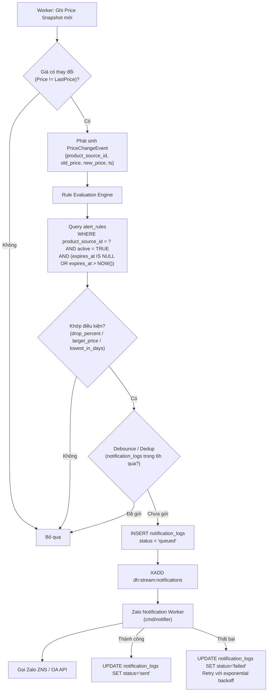

# Deal Hunter — Kế Hoạch & Thiết Kế Phase 2 (Alert Engine + Zalo)

Tài liệu này đặc tả kiến trúc kỹ thuật và lộ trình triển khai **Phase 2: Bộ Máy Cảnh Báo Giá & Thông Báo Qua Zalo** cho hệ thống Deal Hunter.

> **Nguồn gốc**: Dựa trên Roadmap tại [`docs/plans/phase-1-core-tracking.md`](./phase-1-core-tracking.md) — mục 28 "Phase 2 — Alert Engine + Zalo".

---

## 1. Mục Tiêu Của Phase 2

| # | Mục tiêu | Roadmap item |
|---|-----------|--------------|
| 1 | Phát hiện biến động giá giữa 2 snapshot liên tiếp | Price change event |
| 2 | Cho phép người dùng tạo luật cảnh báo giá | Alert rule model |
| 3 | Bộ máy đánh giá luật tự động | Rule evaluation engine |
| 4 | Hỗ trợ 3 loại điều kiện: giảm ≥ X%, giá ≤ X, đáy N ngày | 3 rule types |
| 5 | Luật có thể hết hạn theo thời gian | Alert expiration |
| 6 | Không gửi trùng thông báo cho cùng sự kiện | Dedup notification |
| 7 | Không gửi thông báo liên tục khi giá biến động giật cục | Debounce notification |
| 8 | Tích hợp Zalo OA để gửi tin nhắn tự động | Zalo connection |
| 9 | Gửi tin theo mẫu (template) đã định sẵn trên Zalo | Zalo template integration |
| 10 | Worker xử lý hàng đợi thông báo độc lập | Zalo notification worker |

---

## 2. Kiến Trúc Luồng Cảnh Báo (Alert Flow)



### 2.1. Tích hợp vào cmd processes hiện có

Phase 2 **thêm 1 process mới** (`cmd/notifier`), không sửa process hiện có:

| Process | Vai trò Phase 2 |
|---------|-----------------|
| `cmd/api` | Thêm endpoints CRUD alert rules; wiring `AlertRepository` |
| `cmd/worker` | Sau khi ghi snapshot thành công → gọi `RuleEngine.Evaluate()` inline |
| `cmd/scheduler` | Không thay đổi |
| `cmd/notifier` (**mới**) | Consumer Redis Stream `dh:stream:notifications` → gọi Zalo API |

---

## 3. Thiết Kế Cơ Sở Dữ Liệu Phase 2 (Migration 000002)

> **Lưu ý**: Phase 2 giả định đã có bảng `users` (sẽ tạo trong migration 000002 nếu chưa có).

### 3.0. Bảng `users` (nếu chưa tồn tại)
```sql
CREATE TABLE IF NOT EXISTS users (
    id         UUID PRIMARY KEY DEFAULT gen_random_uuid(),
    zalo_id    TEXT UNIQUE,                   -- Zalo User ID để gửi tin
    phone      TEXT,
    created_at TIMESTAMPTZ NOT NULL DEFAULT NOW()
);
```

### 3.1. Bảng `alert_rules` (Luật cảnh báo người dùng đặt)
```sql
CREATE TABLE alert_rules (
    id                UUID PRIMARY KEY DEFAULT gen_random_uuid(),
    user_id           UUID NOT NULL REFERENCES users(id) ON DELETE CASCADE,
    product_source_id UUID NOT NULL REFERENCES product_sources(id) ON DELETE CASCADE,
    rule_type         VARCHAR(32) NOT NULL
                          CHECK (rule_type IN ('drop_percent', 'target_price', 'lowest_in_days')),
    threshold_value   BIGINT NOT NULL,
    -- drop_percent:   threshold_value = % giảm (vd: 15 nghĩa là giảm >= 15%)
    -- target_price:   threshold_value = giá VND (vd: 1000000)
    -- lowest_in_days: threshold_value = số ngày (vd: 30)
    active            BOOLEAN NOT NULL DEFAULT TRUE,
    expires_at        TIMESTAMPTZ,             -- NULL = vĩnh viễn
    created_at        TIMESTAMPTZ NOT NULL DEFAULT NOW(),
    updated_at        TIMESTAMPTZ NOT NULL DEFAULT NOW()
);

CREATE INDEX idx_alert_rules_source_active
    ON alert_rules(product_source_id)
    WHERE active = TRUE;
```

**Alert expiration**: Scheduler hoặc Worker tự filter `expires_at IS NULL OR expires_at > NOW()`. Không cần background job xóa — chỉ cần index partial để query nhanh.

### 3.2. Bảng `notification_logs` (Lịch sử gửi tin & chống spam)
```sql
CREATE TABLE notification_logs (
    id             UUID PRIMARY KEY DEFAULT gen_random_uuid(),
    user_id        UUID NOT NULL REFERENCES users(id),
    alert_rule_id  UUID NOT NULL REFERENCES alert_rules(id),
    channel        VARCHAR(32) NOT NULL DEFAULT 'zalo',
    recipient      TEXT NOT NULL,              -- Zalo User ID hoặc số điện thoại
    status         VARCHAR(32) NOT NULL
                       CHECK (status IN ('queued', 'sent', 'failed')),
    price_before   BIGINT NOT NULL,
    price_after    BIGINT NOT NULL,
    sent_at        TIMESTAMPTZ,
    error_message  TEXT,
    created_at     TIMESTAMPTZ NOT NULL DEFAULT NOW()
);

-- Index cho Dedup query: lần gửi gần nhất của (user, rule)
CREATE INDEX idx_notif_logs_dedup
    ON notification_logs(user_id, alert_rule_id, created_at DESC);
```

**Dedup query** (dùng trong Rule Engine trước khi đẩy queue):
```sql
SELECT EXISTS (
    SELECT 1 FROM notification_logs
    WHERE user_id = $1
      AND alert_rule_id = $2
      AND created_at > NOW() - INTERVAL '6 hours'
      AND status IN ('queued', 'sent')
);
```

---

## 4. Cấu Trúc Mã Nguồn Cần Thêm

```
internal/
├── alert/
│   ├── model.go           -- struct AlertRule, PriceChangeEvent
│   ├── engine.go          -- interface RuleEngine + EvaluateAll()
│   ├── engine_impl.go     -- logic drop_percent, target_price, lowest_in_days
│   └── repository_pg.go   -- ListActiveRules(), CreateRule(), DeactivateRule()
│
├── notification/
│   ├── model.go           -- struct NotificationLog, NotifStatus
│   ├── repository_pg.go   -- InsertLog(), UpdateStatus(), CheckDedup()
│   ├── dedup.go           -- Debounce check wrapper
│   └── zalo/
│       ├── client.go      -- interface ZaloClient + HTTP implementation
│       └── mock_client.go -- Mock cho testing
│
cmd/
└── notifier/
    └── main.go            -- Process mới: Redis Stream consumer → Zalo
```

### 4.1. Interface quan trọng

```go
// internal/alert/engine.go
type RuleEngine interface {
    // Evaluate kiểm tra tất cả active rules cho product_source_id.
    // Trả về danh sách rules khớp (đã filter dedup/debounce).
    Evaluate(ctx context.Context, event PriceChangeEvent) ([]AlertRule, error)
}

// internal/notification/zalo/client.go
type ZaloClient interface {
    SendMessage(ctx context.Context, zaloUserID string, templateID string, params map[string]string) error
}
```

### 4.2. Logic Rule Evaluation

```go
// drop_percent: (old_price - new_price) / old_price * 100 >= threshold_value
func evalDropPercent(event PriceChangeEvent, rule AlertRule) bool {
    if event.OldPrice == 0 { return false }
    drop := (event.OldPrice - event.NewPrice) * 100 / event.OldPrice
    return drop >= rule.ThresholdValue
}

// target_price: new_price <= threshold_value
func evalTargetPrice(event PriceChangeEvent, rule AlertRule) bool {
    return event.NewPrice <= rule.ThresholdValue
}

// lowest_in_days: new_price == MIN(price) trong N ngày
// Cần query: SELECT MIN(price) FROM price_snapshots
//            WHERE product_source_id = ? AND recorded_at > NOW() - N days
func evalLowestInDays(ctx context.Context, db *pgxpool.Pool, event PriceChangeEvent, rule AlertRule) bool
```

---

## 5. Zalo Integration

### 5.1. Cấu hình cần có (environment variables)
```
ZALO_OA_ACCESS_TOKEN=...   # Token của Zalo Official Account
ZALO_TEMPLATE_ID=...       # ID template ZNS đã đăng ký
ZALO_APP_ID=...            # App ID từ Zalo Developer Portal
```

### 5.2. Luồng kết nối Zalo OA
1. Đăng ký Zalo Official Account tại [developers.zalo.me](https://developers.zalo.me)
2. Tạo ZNS Template (phải được Zalo duyệt) với các biến: `{product_name}`, `{old_price}`, `{new_price}`, `{url}`
3. Lấy `access_token` và refresh định kỳ (TTL 3600s) — lưu vào Redis với key `zalo:oa:access_token`
4. Gọi API: `POST https://business.openapi.zalo.me/message/template`

### 5.3. Payload mẫu gọi Zalo ZNS
```json
{
  "phone": "0901234567",
  "template_id": "{{ZALO_TEMPLATE_ID}}",
  "template_data": {
    "product_name": "iPhone 15 Pro Max 256GB",
    "old_price": "32.990.000đ",
    "new_price": "27.990.000đ",
    "url": "https://tiki.vn/..."
  },
  "tracking_id": "{{notification_log_id}}"
}
```

---

## 6. API Endpoints Mới (Phase 2)

```
POST   /api/v1/tracked-products/{id}/alerts      Tạo alert rule mới
GET    /api/v1/tracked-products/{id}/alerts      Xem danh sách alert rules
DELETE /api/v1/alerts/{alert_id}                 Hủy (deactivate) alert rule
GET    /api/v1/alerts/{alert_id}/logs            Xem lịch sử thông báo
```

---

## 7. Checklist Triển Khai Phase 2 (Theo Thứ Tự Dependency)

### Bước 1 — Database
- [ ] Viết `migrations/000002_alerts.up.sql` (users, alert_rules, notification_logs)
- [ ] Viết `migrations/000002_alerts.down.sql`
- [ ] Chạy migration trên môi trường dev

### Bước 2 — Domain Models & Interfaces
- [ ] `internal/alert/model.go`: `AlertRule`, `PriceChangeEvent`
- [ ] `internal/alert/engine.go`: interface `RuleEngine`
- [ ] `internal/notification/model.go`: `NotificationLog`, `NotifStatus`

### Bước 3 — Rule Engine Implementation
- [ ] `internal/alert/engine_impl.go`: logic `drop_percent`, `target_price`
- [ ] `internal/alert/engine_impl.go`: logic `lowest_in_days` (query `price_snapshots`)
- [ ] `internal/alert/repository_pg.go`: `ListActiveRules()`, `CreateRule()`, `DeactivateRule()`
- [ ] Unit tests cho từng rule type

### Bước 4 — Dedup & Notification Repository
- [ ] `internal/notification/repository_pg.go`: `InsertLog()`, `UpdateStatus()`, `CheckDedup()`
- [ ] `internal/notification/dedup.go`: wrapper gọi `CheckDedup()` với window 6h
- [ ] Unit tests cho Dedup logic

### Bước 5 — Tích hợp vào Worker
- [ ] Cập nhật `internal/jobs/worker.go`: sau khi ghi snapshot thành công, so sánh với `LastPrice`
- [ ] Nếu giá thay đổi → gọi `RuleEngine.Evaluate()` → ghi `notification_logs` queued → `XADD dh:stream:notifications`

### Bước 6 — Zalo Client
- [ ] `internal/notification/zalo/client.go`: interface + HTTP implementation
- [ ] `internal/notification/zalo/mock_client.go`: mock cho testing
- [ ] Config: load `ZALO_OA_ACCESS_TOKEN`, `ZALO_TEMPLATE_ID` từ env
- [ ] Redis token cache (key: `zalo:oa:access_token`, TTL: 3000s)

### Bước 7 — Notifier Process
- [ ] `cmd/notifier/main.go`: Redis Stream consumer group `dh:notifier` đọc từ `dh:stream:notifications`
- [ ] Gọi `ZaloClient.SendMessage()` → cập nhật `notification_logs.status`
- [ ] Retry với exponential backoff (tái dụng `pkg/retry`)
- [ ] Prometheus metrics: `notifier_sent_total`, `notifier_failed_total`

### Bước 8 — API Endpoints
- [ ] `POST /api/v1/tracked-products/{id}/alerts`
- [ ] `GET /api/v1/tracked-products/{id}/alerts`
- [ ] `DELETE /api/v1/alerts/{alert_id}`
- [ ] `GET /api/v1/alerts/{alert_id}/logs`

### Bước 9 — Testing & Hoàn thiện
- [ ] Integration test: TrackURL → Price change → Rule match → Notification queued
- [ ] Integration test: Dedup (gửi 2 lần trong 6h chỉ gửi 1 lần)
- [ ] Integration test: Alert expiration (expires_at đã qua → không gửi)
- [ ] E2E test với Zalo mock
