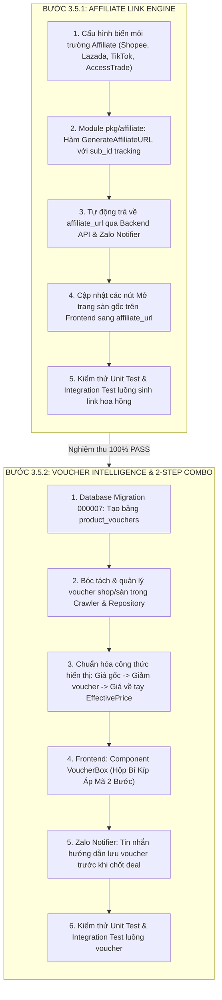

# DealHunter — Kế Hoạch & Thiết Kế Kỹ Thuật Phase 3.5
# (Monetization & Voucher Engine — Tiếp Thị Liên Kết & Săn Sale 2 Bước)

> **Mục tiêu tài liệu**: Đặc tả chi tiết kiến trúc kỹ thuật, mô hình dữ liệu, cơ chế sinh dòng tiền hoa hồng (Affiliate Marketing) và luồng săn voucher thực chiến 2 bước cho hệ sinh thái **DealHunter** trước khi bước sang Phase 4 (Price Intelligence).
>
> **Vị trí trong lộ trình tổng thể**:
> * **Phase 1**: Core Tracking & Snapshot Engine (Đã hoàn thành)
> * **Phase 2**: User Alerts & Zalo Notification (Đã hoàn thành)
> * **Phase 3**: Cross-platform Price Comparison (Đã hoàn thành)
> * **GAP 01 - 04**: Scraper thật, Google Auth, Auto-matching, Zalo OA Production (Đã hoàn thành)
> * **PHASE 3.5**: **Monetization & Voucher Engine (Đã triển khai — còn hạng mục gia cố, xem `hardening-before-phase-4.md`)**
> * **HARDENING**: Gia cố bảo mật, độ tin cậy & dữ liệu trước Phase 4 (GIAI ĐOẠN HIỆN TẠI)
> * **Phase 4**: Price Intelligence (Deal Score 1-10, Fake Discount Detector, Volatility)
> * **Phase 5**: Auto Hunt (Tự động săn deal theo từ khóa & ngân sách)
> * **Phase 6**: Đóng gói Docker toàn diện & Triển khai Cloud (Deployment)

---

## 1. Bối Cảnh & Đặt Vấn Đề

1. **Khoảng trống doanh thu (Monetization Gap)**:
   * Hiện tại, toàn bộ các nút *"Mở trang sàn gốc"*, *"Xem sản phẩm"* trên Web và đường link trong tin nhắn Zalo OA đều đang trả về đường link gốc (`canonical_url`, ví dụ: `https://shopee.vn/product/...`).
   * Khi người dùng nhấp vào link và hoàn tất đơn hàng, hệ thống **không thu được bất kỳ khoản hoa hồng nào từ sàn TMĐT**.
   * Cần một **Affiliate Link Engine** tự động chuyển đổi link gốc thành link tiếp thị liên kết (Affiliate Deeplink) có gắn mã định danh hoa hồng của DealHunter.

2. **Hành vi săn sale thực tế tại Việt Nam (The Voucher Reality)**:
   * Tại thị trường Việt Nam (Shopee, Lazada, TikTok Shop), giá "hời" thực tế của một deal hầu như luôn đòi hỏi người mua phải **lưu voucher của Shop** hoặc **voucher của Sàn** (mã giảm 10% - 15%, mã Shopee Video, Shopee Live, Freeship Extra).
   * Nếu DealHunter chỉ gửi link sản phẩm mà không hướng dẫn lấy voucher, người dùng mở app sàn sẽ thấy giá chưa giảm và bỏ đi, làm giảm sút nghiêm trọng tỷ lệ chuyển đổi (Conversion Rate).
   * **Chiến thuật "Combo 2 Bước"**: Hướng dẫn người dùng **Bước 1: Lưu mã voucher sàn/shop** $\to$ **Bước 2: Bấm vào sản phẩm để áp mã mua ngay**. Đồng thời, chính thao tác bấm lưu voucher ở Bước 1 sẽ kích hoạt sớm cookie hoa hồng affiliate 7 – 30 ngày cho DealHunter (Early Cookie Drop).

---

## 2. Phân Rã Công Việc Độc Lập (Chia Nhỏ Tuyệt Đối — Không Gộp)

Để tránh tình trạng quá tải hoặc bỏ sót tính năng, Phase 3.5 được chia tách thành **2 bước thực hiện tuần tự và độc lập**:



---

## 3. Đặc Tả Kỹ Thuật Bước 3.5.1: Affiliate Link Engine

### 3.1. Cấu Hình Biến Môi Trường (`pkg/config/config.go`)

Bổ sung các tham số cấu hình tiếp thị liên kết:

```ini
# Affiliate Marketing Credentials
AFFILIATE_ENABLED=true
SHOPEE_AFFILIATE_ID=
SHOPEE_AFFILIATE_URL_TEMPLATE=https://s.shopee.vn/universal-link?url={URL}&sub_id={SUB_ID}
LAZADA_AFFILIATE_ID=
LAZADA_AFFILIATE_URL_TEMPLATE=https://s.lazada.vn/s.xxxx?url={URL}&aff_sub={SUB_ID}
TIKTOK_AFFILIATE_ID=
ACCESSTRADE_DEEPLINK_URL=https://go.isclix.com/deep_link/v2/xxxx?url={URL}&utm_source=dealhunter&utm_content={SUB_ID}
```

* **Quy tắc an toàn (Fail-safe)**: Nếu `AFFILIATE_ENABLED=false` hoặc chưa điền mã Affiliate ID cho sàn tương ứng, hệ thống tự động giữ nguyên `canonical_url` gốc, đảm bảo người dùng vẫn truy cập được sản phẩm bình thường.

### 3.2. Thiết Kế Module `pkg/affiliate`

```go
package affiliate

type LinkTransformer interface {
    Transform(rawURL string, platform string, subID string) string
}

type Transformer struct {
    cfg *Config
}

func NewTransformer(cfg *Config) *Transformer

// Transform chuyển đổi URL gốc sang URL tiếp thị liên kết có gắn mã hoa hồng
func (t *Transformer) Transform(rawURL string, platform string, subID string) string
```

* **Cơ chế Tracking SubID**: Truyền mã `subID` dạng `u_{user_id}_p_{product_id}` giúp DealHunter đối soát chính xác người dùng nào hoặc sản phẩm nào đem lại đơn hàng thành công khi sàn trả báo cáo đối soát.

### 3.3. Tích Hợp Vào Backend API & Zalo Notifier

1. **Mở rộng Schema `ProductSource` & `EnrichedTracking`**:
   * Bổ sung trường `affiliate_url` (nullable text).
   * Khi truy vấn chi tiết sản phẩm hoặc danh sách theo dõi, service tự động tính toán `affiliate_url = transformer.Transform(canonical_url, platform, subID)`.
2. **Zalo Notification Engine (`internal/notification/notifier.go`)**:
   * Khi tạo payload gửi tin Zalo, đường link mở xem deal tự động được bọc qua `affiliate_url`.

### 3.4. Tích Hợp Frontend DealHunter Web

* Các nút điều hướng sang sàn gốc:
  * Nút "Mở trang sàn gốc" tại trang chi tiết: `href={source.affiliate_url || source.canonical_url}`.
  * Nút "Xem trên Shopee / Lazada / TikTok" trong bảng so sánh giá chéo.
  * Giữ nguyên `rel="noopener noreferrer" target="_blank"` chuẩn bảo mật.

---

## 4. Đặc Tả Kỹ Thuật Bước 3.5.2: Voucher Intelligence & 2-Step Combo

### 4.1. Thiết Kế Cơ Sở Dữ Liệu (Migration `000007_vouchers.up.sql`)

```sql
-- 000007_vouchers.up.sql
-- Quản lý danh mục voucher của Shop và Sàn cho từng nguồn sản phẩm

CREATE TABLE IF NOT EXISTS product_vouchers (
    id                UUID PRIMARY KEY DEFAULT gen_random_uuid(),
    product_source_id UUID NOT NULL REFERENCES product_sources(id) ON DELETE CASCADE,
    voucher_type      VARCHAR(32) NOT NULL 
                          CHECK (voucher_type IN ('shop_voucher', 'platform_voucher', 'freeship_voucher')),
    voucher_code      TEXT,
    title             TEXT NOT NULL,
    discount_amount   BIGINT NOT NULL DEFAULT 0,
    discount_percent  INT NOT NULL DEFAULT 0,
    min_order_value   BIGINT NOT NULL DEFAULT 0,
    collect_url       TEXT,
    expires_at        TIMESTAMPTZ,
    created_at        TIMESTAMPTZ NOT NULL DEFAULT NOW(),
    updated_at        TIMESTAMPTZ NOT NULL DEFAULT NOW()
);

CREATE INDEX IF NOT EXISTS idx_product_vouchers_source
    ON product_vouchers(product_source_id, expires_at);

-- Bổ sung trường bóc tách voucher vào bảng price_snapshots
ALTER TABLE price_snapshots
    ADD COLUMN IF NOT EXISTS shop_discount BIGINT NOT NULL DEFAULT 0,
    ADD COLUMN IF NOT EXISTS platform_coupon BIGINT NOT NULL DEFAULT 0;
```

### 4.2. Chuẩn Hóa Công Thức Tính Giá Thực Trả (Effective Price Engine)

Khi cào giá hoặc tổng hợp giá:

$$\text{EffectivePrice} = \max\Big(0,\ \text{ListedPrice} - \text{ShopDiscount} - \text{PlatformCoupon}\Big) + \text{ShippingFee}$$

* Ví dụ minh họa:
  * Giá niêm yết Shopee: `6.290.000đ`
  * Voucher Shop: `-300.000đ` (Mã giảm 5% cho đơn từ 5tr)
  * Voucher Sàn (Shopee Live / Video): `-540.000đ` (Mã giảm 10% tối đa 600k)
  * Phí vận chuyển sau mã Freeship Extra: `0đ`
  * **Giá về tay (`EffectivePrice`)**: `5.450.000đ` (Tiết kiệm thực tế: `840.000đ`).

### 4.3. Giao Diện Người Dùng: Component `VoucherBox` (Hộp Bí Kíp Săn Sale 2 Bước)

Vị trí hiển thị: Đặt nổi bật ngay dưới khối giá và trên biểu đồ lịch sử giá tại `app/tracking/[id]/page.tsx`:

* **Thiết kế khối giao diện**:
  1. **Bước 1 — Thu Thập Mã**:
     * Danh sách các mã voucher khả dụng (Shop voucher, Freeship, Voucher sàn).
     * Nút bấm `[Lưu Mã Giảm 15% Của Shop]` $\to$ Dẫn trực tiếp tới link thu thập mã của shop (được bọc link Affiliate để kích hoạt cookie hoa hồng ngay lập tức).
  2. **Bước 2 — Chốt Deal Với Giá Ưu Đãi**:
     * Hiển thị bảng tóm tắt chiết khấu: Giá niêm yết $\to$ Tổng giảm trừ $\to$ Giá về tay.
     * Nút bấm chính `[Mua Ngay Với Giá 5.450.000đ]` $\to$ Dẫn tới trang sản phẩm để người dùng chọn mã vừa lưu và thanh toán.

### 4.4. Tin Nhắn Thông Báo Zalo OA / ZNS

Nội dung tin nhắn mẫu khi giá chạm đáy nhờ voucher:

```text
DealHunter: Tai nghe Sony WH-1000XM5 vừa có deal chạm đáy!
- Giá niêm yết: 6.290.000đ
- Giá sau khi áp mã: 5.450.000đ (Tiết kiệm 840.000đ)

BÍ KÍP CHỐT DEAL 2 BƯỚC:
1. Nhấn để lưu mã Shop 300k: [LINK LƯU MÃ]
2. Nhấn mở sản phẩm và áp mã mua ngay: [LINK MUA HÀNG]
```

---

## 5. Tiêu Chuẩn Nghiệm Thu Hoàn Thành (Definition of Done — DoD)

Phase 3.5 được coi là hoàn tất khi đáp ứng đầy đủ các tiêu chí sau:

1. **Bước 3.5.1 DoD**:
   * Khi cấu hình `SHOPEE_AFFILIATE_ID` / `ACCESSTRADE_DEEPLINK_URL`, tất cả đường link sàn trên Web và Zalo đều tự động gắn mã tiếp thị liên kết hợp lệ.
   * Khi không cấu hình (hoặc tắt cờ), hệ thống giữ nguyên link gốc, không phát sinh lỗi 404 hay gãy điều hướng.
   * Viết unit test cho `pkg/affiliate` đạt độ bao phủ 100%.
2. **Bước 3.5.2 DoD**:
   * Migration `000007_vouchers.up.sql` chạy thành công trên PostgreSQL.
   * API trả về danh sách voucher khả dụng kèm theo từng `ProductSource`.
   * Giao diện Web hiển thị component `VoucherBox` 2 bước chuẩn xác, đa ngôn ngữ i18n (`vi.ts`, `en.ts`), và tuân thủ tuyệt đối quy chuẩn Zero-Emoji.
   * Viết integration test E2E kiểm tra toàn bộ luồng lưu voucher và tính giá `EffectivePrice`.
