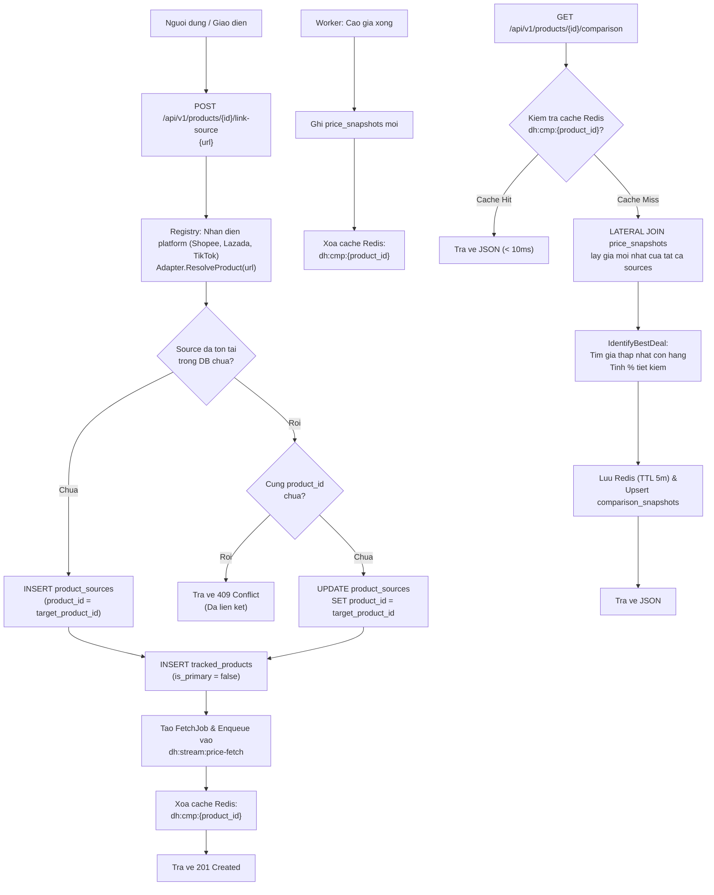

# Deal Hunter — Ke Hoach & Thiet Ke Phase 3 (Cross-platform Price Comparison)

Tai lieu nay dac ta kien truc ky thuat, thiet ke du lieu va quy trinh trien khai **Phase 3: So Sanh Gia Da Nen Tang (Multi-marketplace Comparison)** cho he thong Backend Deal Hunter.

> **Nguon goc**: Dua tren Roadmap tai [`docs/plans/phase-1-core-tracking.md`](./phase-1-core-tracking.md) — muc 29 "Phase 3 — Multi-marketplace".

---

## 1. Muc Tieu Cua Phase 3

| # | Muc tieu | Roadmap item | Trang thai |
|---|----------|--------------|:----------:|
| 1 | Bo adapter san Shopee Viet Nam | Shopee adapter | Hoan thanh |
| 2 | Bo adapter san Lazada Viet Nam | Lazada adapter | Hoan thanh |
| 3 | Bo adapter san TikTok Shop Viet Nam | TikTok adapter | Hoan thanh |
| 4 | Chuan hoa thong tin san pham va gia da san | Source normalization | Hoan thanh |
| 5 | Nhom cac nguon ban ve cung 1 thuc the san pham | Product identity matching | Hoan thanh |
| 6 | Tinh toan chenh lech gia va tim deal tot nhat | Cross-platform comparison | Hoan thanh |
| 7 | Chuan hoa cong thuc tinh gia hieu qua | Effective price normalization | Hoan thanh |
| 8 | Caching Redis bang so sanh (TTL 5 phut) | Comparison caching | Hoan thanh |
| 9 | Invalidate cache tu dong khi co gia moi | Cache invalidation pipeline | Hoan thanh |
| 10 | Refresh dinh ky snapshot so sanh gia (10 phut) | Background comparison scheduler | Hoan thanh |

---

## 2. Kien Truc Luong Du Lieu (Comparison & Ingestion Flow)



---

## 3. Thiet Ke Co So Du Lieu (Migration 000003)

### 3.1 Bang Materialized Cache `comparison_snapshots`

```sql
CREATE TABLE IF NOT EXISTS comparison_snapshots (
    id              UUID        PRIMARY KEY DEFAULT gen_random_uuid(),
    product_id      UUID        NOT NULL REFERENCES products(id)        ON DELETE CASCADE,
    source_id       UUID        NOT NULL REFERENCES product_sources(id) ON DELETE CASCADE,
    platform        VARCHAR(32) NOT NULL,
    seller_name     TEXT,
    canonical_url   TEXT        NOT NULL,
    listed_price    BIGINT,
    shipping_fee    BIGINT      NOT NULL DEFAULT 0,
    effective_price BIGINT,
    in_stock        BOOLEAN,
    is_best_deal    BOOLEAN     NOT NULL DEFAULT FALSE,
    captured_at     TIMESTAMPTZ,
    refreshed_at    TIMESTAMPTZ NOT NULL DEFAULT NOW()
);

CREATE UNIQUE INDEX IF NOT EXISTS idx_comparison_snapshot_product_source
    ON comparison_snapshots(product_id, source_id);

CREATE INDEX IF NOT EXISTS idx_comparison_snapshot_product
    ON comparison_snapshots(product_id, effective_price);
```

### 3.2 Bo Sung Cot `is_primary` Cho `tracked_products`

```sql
ALTER TABLE tracked_products
    ADD COLUMN IF NOT EXISTS is_primary BOOLEAN NOT NULL DEFAULT TRUE;

CREATE INDEX IF NOT EXISTS idx_tracked_products_user_primary
    ON tracked_products(user_id, is_primary)
    WHERE active = TRUE;
```

---

## 4. Cau Truc Ma Nguon Da Trien Khai

```text
deal_hunter/
├── internal/
│   ├── comparison/                     -- Package moi chuyen trach so sanh gia
│   │   ├── model.go                   -- SourcePrice, ComparisonResult, BestDealSummary, IdentifyBestDeal
│   │   ├── model_test.go              -- Unit test logic tim deal tot nhat (6 test cases)
│   │   ├── cache.go                   -- Interface ComparisonCache
│   │   ├── cache_redis.go             -- Implement Redis cache (dh:cmp:<product_id>, TTL 5m)
│   │   ├── repository.go              -- Interface ComparisonRepository
│   │   ├── repository_pg.go           -- Implement PostgreSQL (LATERAL JOIN toi price_snapshots)
│   │   ├── service.go                 -- ComparisonService (BuildComparison, GetComparison, RefreshAll)
│   │   └── service_test.go            -- Unit test cache-first logic (4 test cases)
│   │
│   ├── marketplace/                    -- Bo 3 Adapters san TMDT
│   │   ├── shopee/adapter.go          -- Shopee Vietnam Adapter
│   │   ├── lazada/adapter.go          -- Lazada Vietnam Adapter
│   │   ├── tiktok/adapter.go          -- TikTok Shop Vietnam Adapter
│   │   └── mock/adapter.go            -- Mock Adapter ho tro da san (shopee, lazada, tiktok)
│   │
│   ├── tracking/
│   │   ├── service.go                 -- Bo sung LinkSourceToProduct()
│   │   └── repository_pg.go           -- Bo sung is_primary va GetTrackingBySource()
│   │
│   ├── product/
│   │   ├── repository.go              -- Bo sung ProductExists(), AssignProductSource()
│   │   └── repository_pg.go           -- Implement 2 phuong thuc tren
│   │
│   ├── http/
│   │   ├── handler.go                 -- Bo sung ProductID, resolveCanonicalProductID(), 4 handlers
│   │   ├── handler_test.go            -- Unit test HTTP handlers (10 test cases)
│   │   └── router.go                  -- Dang ky 4 routes moi vao /api/v1
│   │
│   └── jobs/
│       └── worker.go                  -- Invalidate cache Redis sau khi commit price thanh cong
│
├── cmd/
│   ├── api/main.go                    -- Wire ComparisonService va dang ky shopee/tiktok adapter
│   ├── worker/main.go                 -- Inject ComparisonCache va dang ky shopee/tiktok adapter
│   └── scheduler/main.go              -- Ticker refresh comparison snapshots dinh ky 10 phut
│
├── migrations/
│   ├── 000003_cross_platform.up.sql
│   └── 000003_cross_platform.down.sql
│
└── tests/
    └── integration/
        └── comparison_flow_test.go    -- Integration test end-to-end cho toan bo luong Phase 3
```

---

## 5. Danh Muc API Endpoints Moi

| Method | Endpoint | Mo ta chuc nang |
|---|---|---|
| `GET` | `/api/v1/products/{product_id}/comparison` | Tra ve bang so sanh gia day du cua tat ca cac san kem deal tot nhat |
| `POST` | `/api/v1/products/{product_id}/link-source` | Lien ket mot URL san khac vao nhom san pham logic de bat dau theo doi |
| `GET` | `/api/v1/product-groups` | Lay danh sach cac nhom san pham ma user dang theo doi co tu 2 san tro len |
| `GET` | `/api/v1/tracked-products/{id}/comparison` | Shortcut tu dong phan giai ID theo doi / ID nguon de tra ve bang so sanh |

---

## 6. Checklist Kiem Dinh & Nghiem Thu Phase 3

### 6.1 Database & Migrations
- [x] Migration `000003_cross_platform.up.sql` tao bang `comparison_snapshots` va cot `is_primary`
- [x] Migration `000003_cross_platform.down.sql` rollback sach se
- [x] Cong cu migrate `cmd/migrate` bien dich thanh cong

### 6.2 Domain & Core Logic
- [x] `IdentifyBestDeal` xu ly chinh xac: bo qua het hang, bo qua gia <= 0, tinh % tiet kiem
- [x] 100% Unit test `internal/comparison/model_test.go` PASS
- [x] 100% Unit test `internal/comparison/service_test.go` PASS
- [x] 100% Unit test `internal/http/handler_test.go` PASS

### 6.3 Adapters & Registry
- [x] Shopee Adapter xu ly nhan dien domain `shopee.vn`
- [x] Lazada Adapter xu ly nhan dien domain `lazada.vn`
- [x] TikTok Shop Adapter xu ly nhan dien domain `tiktok.com`
- [x] Mock Adapter ho tro mo phong da san khong gay trung lap khoa `(platform, external_product_id)`

### 6.4 Tich Hop Pipeline
- [x] Worker tu dong xoa cache Redis `dh:cmp:{product_id}` moi khi co snapshot gia moi
- [x] Scheduler chay ticker dinh ky 10 phut refresh snapshot cac san pham da san
- [x] Phien ban hoa JSON dam bao khong tra ve `null` cho mang rong (`sources: []`, `groups: []`)

### 6.5 Tieu Chuan Toan He Thong
- [x] `go build ./cmd/...` bien dich thanh cong 5/5 binary (api, worker, scheduler, notifier, migrate)
- [x] `go test -v ./...` dat 100% PASS tren toan bo 27 test suites
- [x] `go vet ./...` dat 0 warning, 0 error
- [x] Kiem tra quy chuan khong su dung ky tu emoji (0 emoji tren toan bo ma nguon va tai lieu)

### 6.6 Kiem Dinh Tich Hop Toan Dien Full HTTP Flow (E2E Verification)
- [x] Test suite: `tests/integration/http_phase3_flow_test.go` (`TestPhase3FullHTTPFlow`)
- [x] Test suite: `tests/integration/comparison_flow_test.go` (`TestEndToEndComparisonFlow`)
- [x] Step 1: Theo doi san pham Shopee ban dau qua `POST /api/v1/tracked-products` (201 Created)
- [x] Step 2: Lay bang so sanh khi chi co 1 san qua `GET /api/v1/tracked-products/{id}/comparison` (200 OK)
- [x] Step 3: Dan link san thu 2 (TikTok) qua `POST /api/v1/products/{product_id}/link-source` (201 Created, enqueued worker job)
- [x] Step 4: Kiem tra chan trung lap link qua ma loi HTTP 409 Conflict
- [x] Step 5: Xac minh tinh toan Best Deal da san, gia thuc tra re nhat (TikTok: 94.000d vs Shopee: 120.000d, tiet kiem 26.000d - 21%)
- [x] Step 6: Xac minh danh sach nhom san pham da san qua `GET /api/v1/product-groups`
- [x] Step 7: Xac minh danh sach theo doi `GET /api/v1/tracked-products` tra ve `ProductID` dong nhat de render huy hieu "Da san"
- [x] Ket qua: **100% PASS (0.717s, PostgreSQL + Redis live)**
